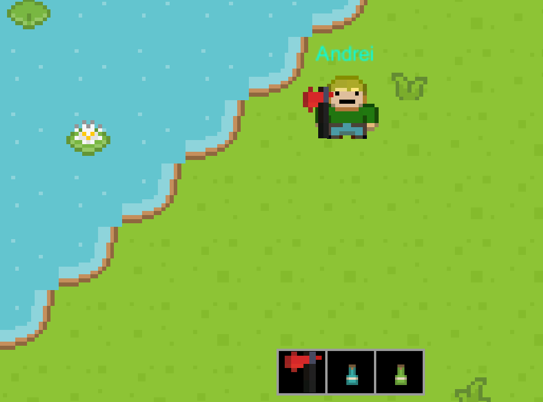
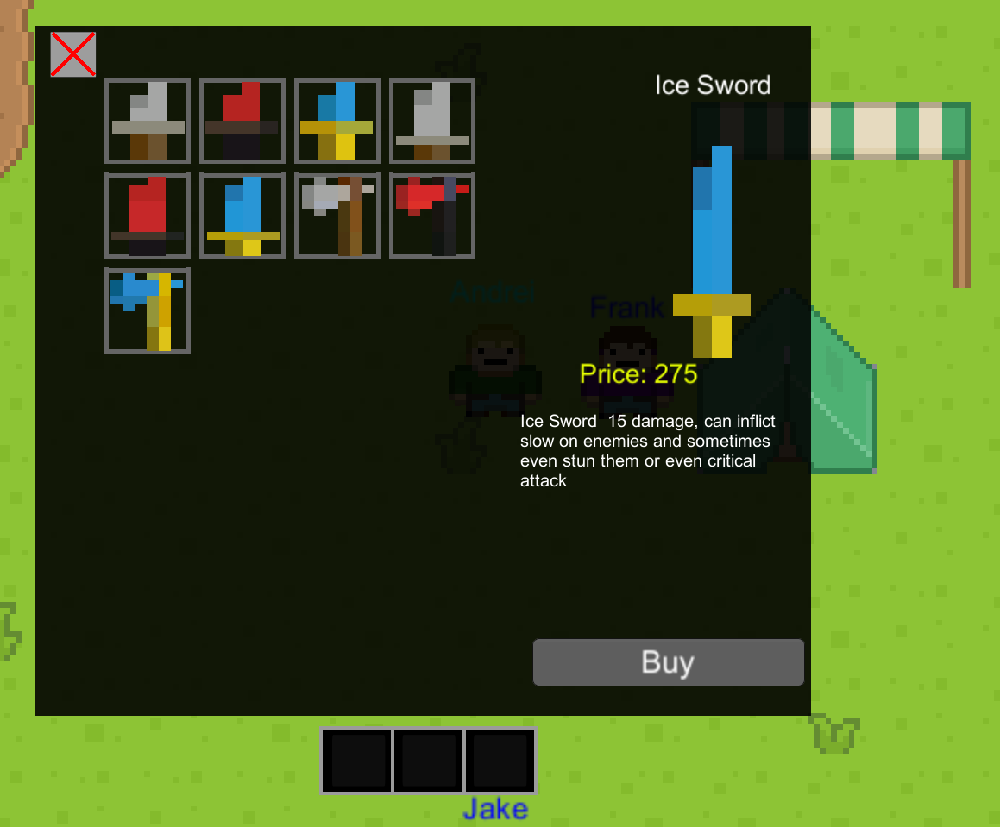
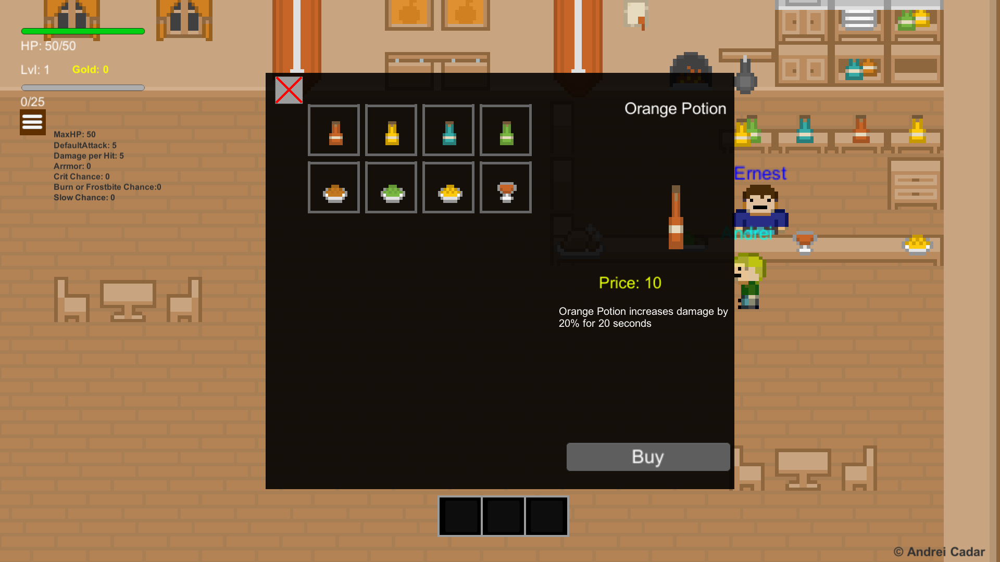

# RPG-2D

One of my greatest projects!
 
It is an RPG game made with Unity Engine that I have developed in my eigth grade. :video_game:

## About

When starting the game the user enters the main menu where he can

<ul>
    <li>Play Game</li>
    <li>Change Name</li>
    <li>Credits</li>
</ul>
The defaule name is Mircea
 

The user also has the **RESET** option which deletes all localy saved data.

## Playing the game

When starting the game the player enters the main village.

 
 
In the top left corner we can see the player base stats

### Player base stats

<ul>
    <li>HP/MaxHP</li>
    <li>Level</li>
    <li>Coins</li>
    <li>XP/Required XP to level up</li>
</ul>

After pressing the **List** button represented by three lines, more combat stats appear

### Player combat stats

### Hotbar

In the bottom of the screen it is the player hotbar, each item can be access by precing `1`, `2` or `3`

#### Notes

<ul>
<li>

_Because usually the player will have a weapon, it can store that weapon and two other consumables_</li>

<li>

_When the slot is empty and it is selected the player will attack with his bare fists_</li>

<li>

_When an consumable is consumed the slot will pe empty_</li>

</ul>
 
The newly selected item will appear in the character's hands.

### NPCs and Quests

#### Quests

<ul>
    <li>Each quest line has its own story and about 4 to 5 quests each</li>
    <li>Each quest also has its own mini-story.</li>
    <li>The quests get harder in difficulty and the rewards are bigger.</li>
    <li>The player can have active multiple quests at a time</li>
</ul>
When progressing through a quest a progress log is displayed in the right part
 

#### NPCs

The game has multiple NPCs, each one having its own quest line or beeing a merchant

<ul>
    <li>Jake: green slime quest line</li>
    <li>Dolgen: red slime quest line</li>
    <li>Ronnie: crystals quest</li>
    <li>Frank: arms dealer</li>
    <li>Ernest: tavern dealer</li>
    <li>Merlin: roses quest</li>
    <li>Theodor: purple slime quest line</li>
    <li>Cave Man: bats quest line</li>
</ul>

#### Enemies

There multiple monsters in the game, but they can be spil into three main categories.

<ul>
    <li>Slimes</li>
    <li>Bats</li>
    <li>Golems</li>
</ul>
 
They have a an area in which they can spawn or move, a frequency of movement, a minimum and maximum movement speed, xp for killing them, chance to drop coins, minimum and maximum ammount of dropped coins.

##### Slimes

 

Currently there are three types of slimes in the game, green red and purple. The last one beeing the strongest. Can only damage the player by running into it.

##### Bats

 

Bats act simillar to slimes but they are faster in movement and go straight towards the player position. After a successful dodge the player can safely attack once.

##### Golems

 

Golems are the most powerfull type of enemy in the game. They are masive, move slowly and have lasers as an ability.

 

### Shops

Currently in the game there are two shops. One for weapons and one for consumables.
 
When a new item is bought it is assigned in first free Hotbar slot

#### Weapons

This shop is found on the main map.
 

There are 3 types of weapons by size:

<ul>
    <li>Dagger</li>
    <li>Sword</li>
    <li>Axe</li>
</ul>
Swords and Axes can critical strike.

 
And also each one belongs to one of three cateogires:

<ul>
    <li>Normal</li>
    <li>Fire</li>
    <li>Ice</li>
</ul>
 
Fire and Ice weapons have a chance to induce damage over time. Fire weapons having a higher damager over time but ice weapons have a chance to slow down the enemies.

_Note: when no weapon is equipped the player attack with bare hands and no additional weapon damage is added._
 

_Note: Swords and axes have a higher hit-box than the bare fist and dagger._

#### Consumables

The tavern man sells consumables that increase player stats over a period of time or permanently.

<ul>
    <li>Potions increase one stat for 20 seconds like damange, movement speed and defense.</li>
    <li>Foods increase two stats for 20 seconds.</li>
    <li>Cereals is a special and expensive type of food which increases the MaximumHP permanentely by 1.</li>
    <li>To consum a consumable the player must choose its inventory space and press click</li>
</ul>

### Music :notes:

The game has only two soundtracks that loop and fit very well the atmosphere of an 2D RPG game.

### Credits

I want to thank here to two of my highschool friends who deisgned the slimes, bats and the golem. The rest of the 2D design was downloaded from a free to use source.
