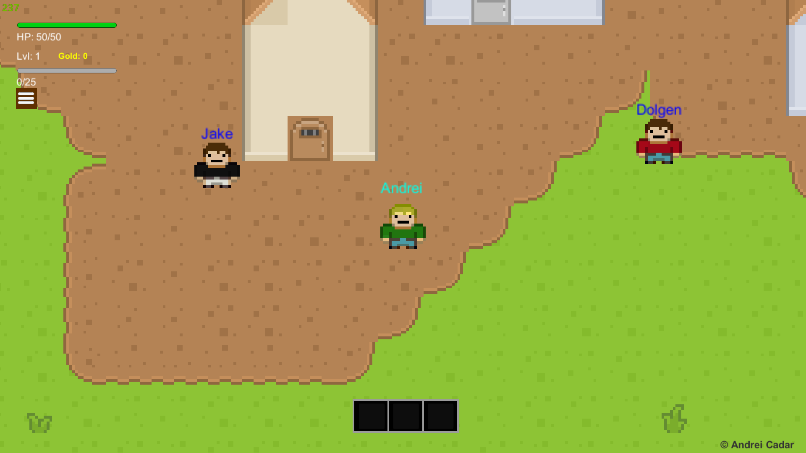
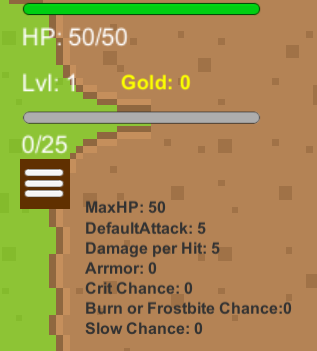
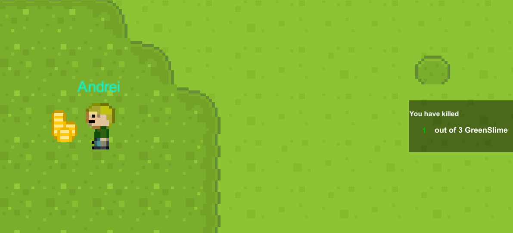
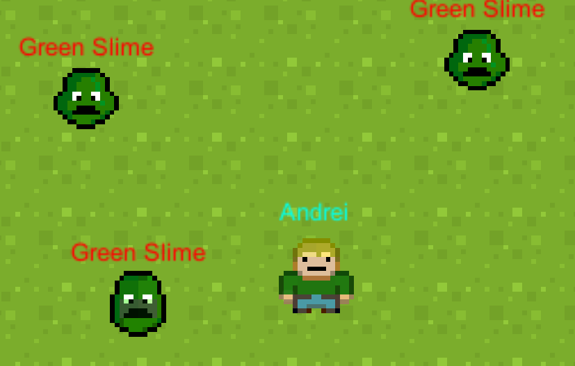
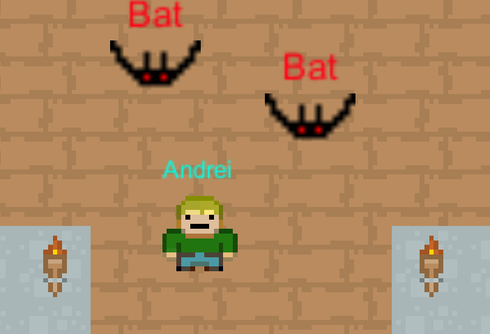
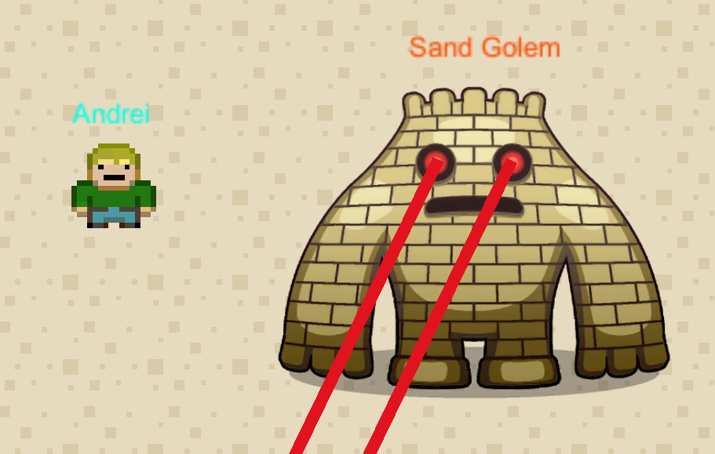

# RPG-2D

One of my greatest projects!
 
It is an RPG game made with Unity Engine that I have developed in my eigth grade. :video_game:

## About

When starting the game the user enters the main menu where he can

<ul>
    <li>Play Game</li>
    <li>Change Name</li>
    <li>Credits</li>
</ul>
The defaule name is Mircea
 

The user also has the **RESET** option which deletes all localy saved data.

## Playing the game

When starting the game the player enters the main village.

 
 
In the top left corner we can see the player base stats

### Player base stats

<ul>
    <li>HP/MaxHP</li>
    <li>Level</li>
    <li>Coins</li>
    <li>XP/Required XP to level up</li>
</ul>

After pressing the **List** button represented by three lines, more combat stats appear

### Player combat stats

### NPCs and Quests

#### Quests

<ul>
    <li>Each quest line has its own story and about 4 to 5 quests each</li>
    <li>Each quest also has its own mini-story.</li>
    <li>The quests get harder in difficulty and the rewards are bigger.</li>
</ul>
When progressing through a quest a progress log is displayed in the right part

#### NPCs

The game has multiple NPCs, each one having its own quest line or beeing a merchant

<ul>
    <li>Jake: green slime quest line</li>
    <li>Dolgen: red slime quest line</li>
    <li>Ronnie: crystals quest</li>
    <li>Frank: arms dealer</li>
    <li>Ernest: tavern dealer</li>
    <li>Merlin: roses quest</li>
    <li>Theodor: purple slime quest line</li>
    <li>Cave Man: bats quest line</li>
</ul>

#### Enemies

There multiple monsters in the game, but they can be spil into three main categories.

<ul>
    <li>Slimes</li>
    <li>Bats</li>
    <li>Golems</li>
</ul>
 
They have a an area in which they can spawn or move, a frequency of movement, a minimum and maximum movement speed, xp for killing them, chance to drop coins, minimum and maximum ammount of dropped coins.

##### Slimes

 

Currently there are three types of slimes in the game, green red and purple. The last one beeing the strongest. Can only damage the player by running into it.

##### Bats

 

Bats act simillar to slimes but they are faster in movement and go straight towards the player position. After a successful dodge the player can safely attack once.

##### Golems

 

Golems are the most powerfull type of enemy in the game. They are masive, move slowly and have lasers as an ability.

